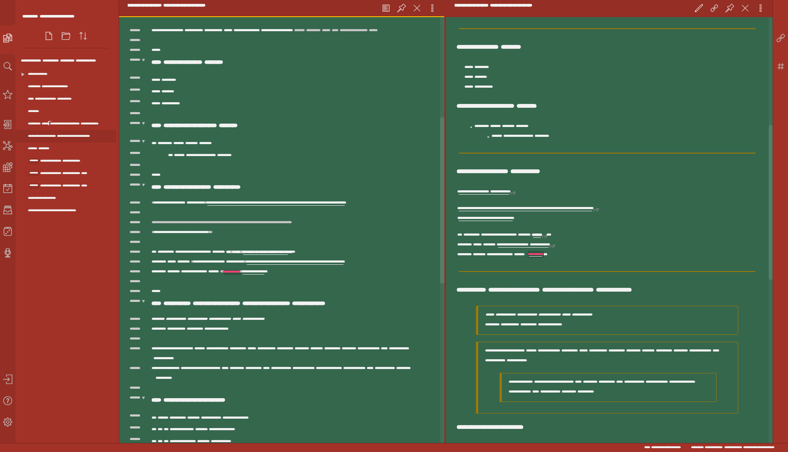

# Obsidian Christmas Theme
A festive theme for [Obsidian](https://obisidian.md/) inspired by the Dynalist Christmas theme

(Oh, and there's a festive surprise hidden inside. If you don't like it, edit the obsidian.css and remove it)

## Install
1. Download obsidian.css to your Obsidian vault folder.
2. In Obsidian, click Settings->Plugins and turn on "Custom CSS".
3. Enjoy the festive surprise!

## Licence
I don't really care what happens to this theme, so I put it under [The Unlicense](./LICENSE) and set it free!
